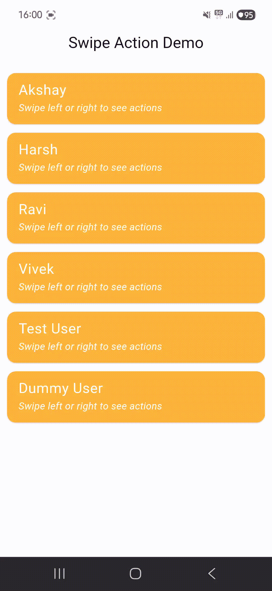

# library_flutter_swipeaction_recycleview

A high-performance, production-ready swipe action library for Flutter that enables smooth, WhatsApp-style contextual actions for list items.

## Overview

`library_flutter_swipeaction_recycleview` provides a highly customizable `CustomSwipeActionTile` widget. It allows users to swipe list items to the left or right to reveal action buttons (e.g., Delete, Archive, Edit). Designed with performance and UX in mind, it handles rapid gestures, ensures smooth animations, and integrates seamlessly with `ListView.builder` through proper state management and widget recycling support.

## When To Use

This library is ideal for any application that requires efficient list management and contextual actions:
*   **Chat Applications**: Quickly archive or delete conversations.
*   **Email Clients**: Swipe to mark as read, flag, or move to trash.
*   **To-Do & Productivity Apps**: Mark tasks as complete or reschedule.
*   **E-commerce**: Add items to favorites or remove from cart.
*   **Admin Dashboards**: Efficiently manage table rows or list items.

## Features

| Feature | Description |
| :--- | :--- |
| **Swipe Left Actions** | Support for multiple actions when swiping from right-to-left. |
| **Swipe Right Actions** | Support for multiple actions when swiping from left-to-right. |
| **Animation Support** | Fluid `CurvedAnimation` with `Curves.easeOutCubic` for natural feel. |
| **Gesture Handling** | Robust handling of horizontal drags with velocity-based snapping. |
| **Haptic Feedback** | Integrated `HapticFeedback.mediumImpact()` on action activation. |
| **Customizable Width** | Define a fixed `actionWidth` for all revealed action buttons. |
| **Drag Resistance** | Configurable resistance (0.0 to 1.0) to simulate physical weight. |
| **Snapping Behavior** | Automatically snaps to "Open" or "Closed" states based on threshold. |
| **Recycling Safe** | Properly resets internal state when used inside a recycling `ListView`. |

## How It Works

The architecture relies on a layered `Stack` approach:
1.  **Action Layer**: Positioned behind the main content, rendering actions based on the current swipe direction.
2.  **Content Layer**: The main `child` widget wrapped in a `Transform.translate` that responds to drag events.
3.  **Gesture Detection**: A `GestureDetector` monitors horizontal movement and updates an internal `_offset` with applied `dragResistance`.
4.  **Animation Controller**: Manages the transition between swiped and idle states, ensuring only one animation runs at a time to prevent conflicts.

## Installation

Add the dependency to your `pubspec.yaml`:

```yaml
dependencies:
  library_flutter_swipeaction_recycleview:
    git:
      url: https://github.com/Excelsior-Technologies-Community/library_flutter_SwipeActionRecycleView.git
```

Or via terminal:
```bash
flutter pub add library_flutter_swipeaction_recycleview
```

## Import

```dart
import 'package:library_flutter_swipeaction_recycleview/library_flutter_swipeaction_recycleview.dart';
```

## Usage

Below is a clean example of how to implement the `CustomSwipeActionTile` within a `ListView`.

```dart
import 'package:flutter/material.dart';
import 'package:library_flutter_swipeaction_recycleview/library_flutter_swipeaction_recycleview.dart';

class MySwipeableList extends StatelessWidget {
  final List<String> items = List.generate(20, (i) => "Item ${i + 1}");

  @override
  Widget build(BuildContext context) {
    return ListView.builder(
      itemCount: items.length,
      itemBuilder: (context, index) {
        return CustomSwipeActionTile(
          // Important: Use ValueKey to ensure proper state management during recycling
          key: ValueKey(items[index]),
          actionWidth: 80.0,
          dragResistance: 0.8,
          leftActions: [
            SwipeAction(
              icon: Icons.archive,
              color: Colors.blue,
              onTap: () => print("Archived ${items[index]}"),
            ),
            SwipeAction(
              icon: Icons.share,
              color: Colors.green,
              onTap: () => print("Shared ${items[index]}"),
            ),
          ],
          rightActions: [
            SwipeAction(
              icon: Icons.delete,
              color: Colors.red,
              onTap: () => print("Deleted ${items[index]}"),
            ),
          ],
          child: ListTile(
            title: Text(items[index]),
            subtitle: Text("Swipe left or right to see actions"),
            tileColor: Colors.white,
          ),
        );
      },
    );
  }
}
```

## API / Parameters

| Parameter | Type | Required | Description |
| :--- | :--- | :--- | :--- |
| `child` | `Widget` | Yes | The main content of the tile. |
| `leftActions` | `List<SwipeAction>` | No | List of actions shown when swiped to the right. |
| `rightActions` | `List<SwipeAction>` | No | List of actions shown when swiped to the left. |
| `actionWidth` | `double` | No | Fixed width for each action button (Default: `80.0`). |
| `dragResistance` | `double` | No | Multiplier for drag speed (Default: `0.8`). |

## SwipeAction Model

The `SwipeAction` model is a simple configuration object:

*   **`icon`**: The `IconData` to display.
*   **`color`**: The background `Color` for the action button.
*   **`onTap`**: A `VoidCallback` executed when the action is tapped.

## Advanced Behavior

*   **Velocity Snapping**: If the user flings the tile with a velocity greater than 400, it automatically snaps to the fully open state of that direction.
*   **Threshold Snapping**: If released slowly, it snaps open if dragged past 50% of the total action width, otherwise it snaps closed.
*   **Rubber-Banding**: Includes a small extra drag margin (40.0 pixels) past the action limits with increased resistance for a high-quality tactile feel.

## Best Practices

1.  **Use ValueKey**: Always provide a `ValueKey` using a unique ID of your data to the `CustomSwipeActionTile`. This ensures that when `ListView` recycles widgets, the internal swipe offset and animation state are correctly reset.
2.  **Keep it Lightweight**: Keep the `child` widget efficient. Avoid putting heavy calculation logic inside the tile's build method.
3.  **Action Limits**: While multiple actions are supported, for the best UX, limit actions to 2 or 3 per side.

### Demo




## License

MIT License

Copyright (c) 2026 Excelsior Technologies

Permission is hereby granted, free of charge, to any person obtaining a copy
of this software and associated documentation files (the "Software"), to deal
in the Software without restriction, including without limitation the rights
to use, copy, modify, merge, publish, distribute, sublicense, and/or sell
copies of the Software, and to permit persons to whom the Software is
furnished to do so, subject to the following conditions:

The above copyright notice and this permission notice shall be included in all
copies or substantial portions of the Software.

THE SOFTWARE IS PROVIDED "AS IS", WITHOUT WARRANTY OF ANY KIND, EXPRESS OR
IMPLIED, INCLUDING BUT NOT LIMITED TO THE WARRANTIES OF MERCHANTABILITY,
FITNESS FOR A PARTICULAR PURPOSE AND NONINFRINGEMENT. IN NO EVENT SHALL THE
AUTHORS OR COPYRIGHT HOLDERS BE LIABLE FOR ANY CLAIM, DAMAGES OR OTHER
LIABILITY, WHETHER IN AN ACTION OF CONTRACT, TORT OR OTHERWISE, ARISING FROM,
OUT OF OR IN CONNECTION WITH THE SOFTWARE OR THE USE OR OTHER DEALINGS IN THE
SOFTWARE.
